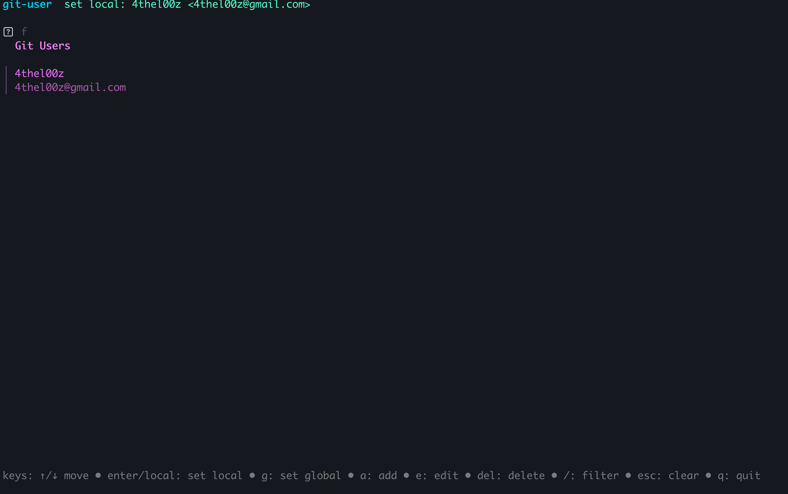

# git-user



## Motivation

I don't want to deal with `git config user.name` etc. on multiple machines.

## Installation

```shell
go install github.com/4thel00z/git-user@latest
```

## License

GPL-3
